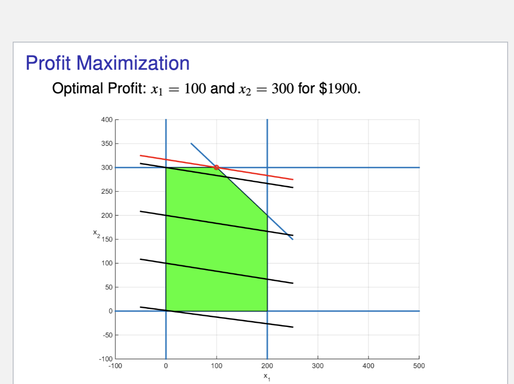
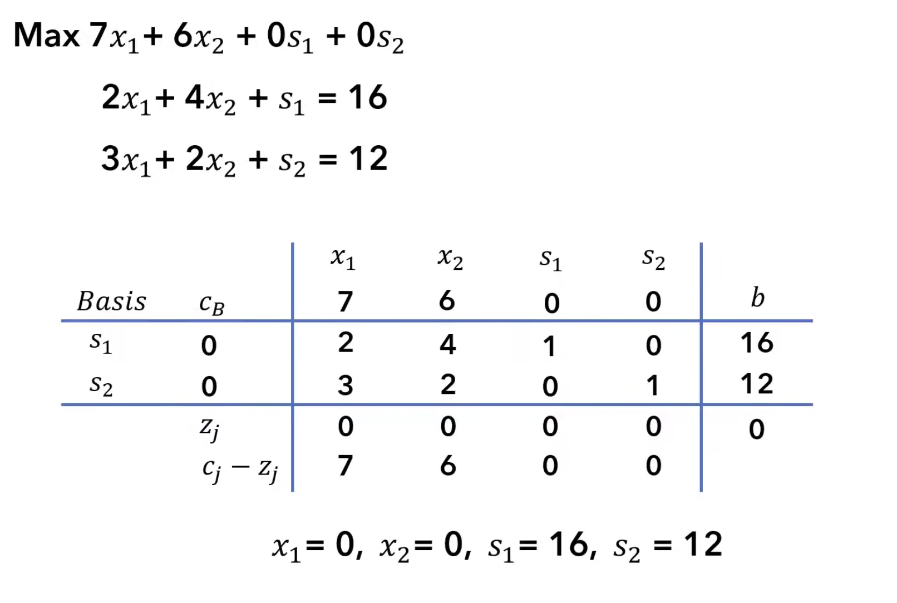

# Final-Project
Linear Programming Final Project

Chad Murphy

## (1) Description

In this project, I was faced with the problem of linear programming. Given an objective function (a function that I would like to maximiaze) and a certain amount of constraints, can I create a program that would output the most optimal answer? For example, I want the largest amount of profit, given the restraints of producing a certain amount of goods. 

## (2) Vocabulary

Objective function: The profit function of producing two goods
Constraints: The restrictive functions on what goods can be produced
Feasible Region: The region where all constraints are met - there will be an edge case where the objective function is maximized
Vertex: The solution to our problem will be on the edge of the constraints (or the vertex). This will eventually be the output of our function. 

## (3) Background

Visually, we can graph all of the constraints on the cartesian plane (for a 2D problem). Once we have done that, we will be able to see a visual representation of the feasibility region. We can then plot our profit function at certain c values (where c is a constant that represents profit). There will be an edge case where we continually move up the profit maximization function until the very border of the constraints on the graph. This will need to be coded so that given any linear constraints and any linear profit maximization function, there will be an output with the optimal profit as well as the amount of each good to be produced. The code must also be able to sense if the constraints are too loose or too tight (no solution or a solution that is infinitely large). 

This visualization from above is all in a 2d example, with only two goods being produced. However, there are infinitely many goods that a company could produce. This function should be able to give an answer given infinite inputs. 

## (4) Features

This project explores a couple features:

(1) This project creates a simplex algorithm from scratch
(2) This project checks to make sure the algorithm is accurate
(3) This project applies the code to an Economics word problem
(4) This project compares runtimes through various dimensions (the user can choose)
(5) This project compares runtimes of the self-created simplex algorithm to the SciPi linear programming function

The methods used in this project are: NumPy library, SciPi library, tolerance considerations, matrix calculations/reductions, raise value errors, random library, time library, matplotlib library.

## (5) Usage

The user can use this project in many ways. 

First, the user can find the an answer to a linear programming questions in n dimensions. In the Profit_Max_Proglem.py file, the user can change the entries for c, A, and b. c is the profit function (profit = 6x1 + x2). A is the constraint matrix (x1 <= 200, x2 <= 300, x1 + x2 <= 400). b are the right hand side values or the maximum available resources. All of these inputs can be changed for the user to solve any problem.

Second, the user can find how long the self-made algorithm takes to run in certain dimensions. The user can change the dimensions they would like to see graphed out. To do so, they should change the numbers within the list called "dimensions" in the Testing_Runtimes.py file. This will change the graph for both the self-created algorithm as well as the comparison to the SciPi linear programming function.

## (6) Testing

The current test cases that are in the files are as follows:

Profit_Max_Problem.py: 

Profit function - profit = x_1 + 6x_2
Constraints - x1 <= 200; x2 <= 300; x1 + x2 <= 400
Output - profit = 1900; x1 = 100; x2 = 300

This test case is based on a profit maximization problem that is typical in Economics. To check if the program is correct, I compared to the linear programming function in SciPi. The output was the same: profit = 1900; x1 = 100; x2 = 300. 

I also tested a three dimensional case to make sure that this code ran with three constraints. That code runs successfully at the bottom of the file, but is commented out. 

Testing_Runtimes.py:

The current test I have relates to the amount of dimensions in the list (dimensions = [50, 100, 200, 400, 600, 800, 1000, 2000]). 

This portion is more exploratory--the user can explore how the trends differ as the dimmensions change. I know this is correct, because the runtime increases as runtime increases (which makes logical sense). I also know that this makes sense, because the general trend compared to the SciPi linear programming function has a similar macro trend, but differs slightly. 

## (7) File Breakdown (for clarity)

Linear_Programming_Main_Code.py: This is the meat of the code for the project. This file defines my whole created algorithm. It iterates through 6 different functions that eventually culminate in the final function (Simplex). There is nothing to be printed in this file, but rather for it to be run first so all other files can draw on the code.

Profit_Max_Problem.py:
This file implements the application of the code. For a given profit function, good 1 constraint, good 2 constraint, combined constarint, and RHS values, it will output the maximum profit as well as the allocation of each good. The user can change the inputs (c, A, b). C is the profit function, A is the constraint matrix, and b has the RHS values. Currently, they are based on the word problem as described in the comment at the beginning. This is then compared to the SciPi linear programming function. Since they are the same, our algorithm is correct!

Testing_Runtimes.py:
This file does two things.
(1) It compares the runtime as we increase the dimmensions of our created Simplex function. The user can change the dimmensions list to input the dimmensions they would like to test. It then graphs these runtimes as a function of dimmensions vs. runtime. 

(2) This function graphs the runtime of the SciPi linear programming function in the same dimmensions. This means we can compare how the runtimes differ between our created function and the SciPi function.

## (8) Appendix and sources

This is an example of what is happening visuallly. The code will find the optimal border point to maximize profit.

This is an example of the tableau that is created within the code. This holds all of the information, and we are able to row reduce the middle part as part of finding the maximum allocation.

Sources:

Crifo, S. (2020). Lecture 12: Linear programming [Lecture slides].

Joshua Emmanuel. (2022, August 17). Intro to Simplex Method | Solve LP | Simplex Tableau [Video]. YouTube. https://www.youtube.com/watch?v=9YKLXFqCy6E

The SciPy community. (n.d.). scipy.optimize.linprog. SciPy v1.17.0 Manual. Retrieved April 30, 2026, from https://docs.scipy.org/doc/scipy/reference/generated/scipy.optimize.linprog.html

Gemini shareable link:
https://gemini.google.com/share/1d0177819bae

